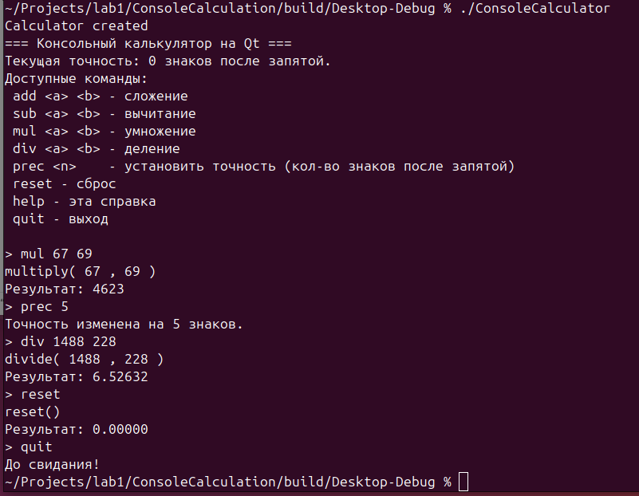

# Лабораторная работа №1. Консольный калькулятор с метаобъектами

**Дисциплина:** Кроссплатформенное программирование  
**Студент:** [Ваше ФИО]  
**Группа:** [Ваша группа]  
**Преподаватель:** [ФИО преподавателя]  
**Дата:** [Дата сдачи]  

## Цель работы
Изучить механизм сигналов и слотов Qt на примере консольного приложения. Освоить наследование от `QObject`, объявление собственных сигналов и слотов, установку соединений через `QObject::connect()`, а также работу с метаобъектной системой Qt (МОС) в консольном режиме без графического интерфейса.

## Постановка задачи (Индивидуальный вариант)
**Вариант: Калькулятор с настраиваемой точностью.**  
Реализовать консольный калькулятор, который позволяет задавать количество знаков после запятой при выводе результатов. Точность должна сохраняться между запусками приложения с помощью класса `QSettings`. Также реализовать запись истории успешных операций в файл `history.txt` (Шаг 7 методических указаний).

## Теоретическое обоснование
Метаобъектная система Qt (МОС) — это расширение C++, позволяющее использовать рефлексию (анализ структуры программы во время выполнения). Для работы сигналов и слотов класс должен:
1. Наследоваться от `QObject`.
2. Содержать макрос `Q_OBJECT` в приватной секции.
3. Объявлять сигналы в секции `signals:`.
4. Объявлять слоты в секции `public slots:`.

МОС (Meta-Object Compiler, `moc`) читает заголовочные файлы и генерирует файлы `moc_*.cpp`, содержащие метаинформацию. Без этого компиляция завершится ошибкой `undefined reference to vtable`. В консольном приложении используется `QCoreApplication` вместо `QApplication`, так как графика не требуется, а для ввода-вывода — `QTextStream`. Настройки сохраняются через `QSettings`, а для работы с файлами используется `QFile`.

## Структура проекта
*   `ConsoleCalculation.pro` — файл конфигурации qmake. Отключен модуль `gui`, подключен `core`. Включен стандарт C++17 и режим `console`.
*   `calculator.h` — заголовочный файл класса `Calculator`. Содержит макрос `Q_OBJECT`, объявления слотов и сигналов.
*   `calculator.cpp` — реализация класса `Calculator`. Содержит логику арифметических операций и обработку ошибок (деление на ноль).
*   `main.cpp` — точка входа. Настройка `QSettings`, парсинг команд, установка соединений сигнал-слот, вывод результатов и запись истории в файл.

## Листинг ключевого кода

### Класс Calculator (calculator.h)
```cpp
class Calculator : public QObject {
    Q_OBJECT
public:
    explicit Calculator(QObject *parent = nullptr);
    // ... геттеры ...
public slots:
    void add(double a, double b);
    void subtract(double a, double b);
    void multiply(double a, double b);
    void divide(double a, double b);
    void reset();
signals:
    void resultReady(double result);
    void errorOccurred(const QString &message);
    // ... приватные поля ...
}; 
```

## Настройка точности в main.cpp
```cpp
QSettings settings;
int precision = settings.value("precision", 2).toInt();
QTextStream out(stdout);
out.setRealNumberNotation(QTextStream::FixedNotation);
out.setRealNumberPrecision(precision);

## Запись истории операций в файл
```cpp
QFile historyFile("history.txt");
historyFile.open(QIODevice::WriteOnly | QIODevice::Append | QIODevice::Text);
QTextStream historyStream(&historyFile);

QObject::connect(&calc, &Calculator::resultReady,
                 [&historyStream](double result) {
                     historyStream << "Result: " << result << "\n";
                     historyStream.flush();
                 });
```

## Пример работы программы



## Разбор ошибок и их решений
В ходе выполнения работы возникли следующие проблемы:
1. **Ошибка `multiple definition of 'main'`**: Возникла из-за дублирования `main.cpp` в файле `.pro`. Решение: удаление дублирующейся строки в `SOURCES` и очистка проекта (`Clean` -> `Run qmake` -> `Build`).
2. **Ошибка `zsh: command not found: git`**: Git не был установлен на виртуальной машине. Решение: установка через `sudo apt install git` и настройка `user.name` / `user.email`.
3. **Опечатка в методичке**: В листинге `main.cpp` был вызван несуществующий метод `calc.substring`. Решение: замена на `calc.subtract`.

## Вывод
В ходе лабораторной работы я изучил механизм сигналов и слотов Qt, научился наследоваться от `QObject` и использовать макрос `Q_OBJECT`. Я освоил работу с `QSettings` для сохранения пользовательских настроек между запусками и `QFile` для ведения логов. Также я получил практические навыки работы с системой сборки `qmake` и Git.

## Ссылка на репозиторий
[https://github.com/Exaynts/ConsoleCalculator](https://github.com/Exaynts/ConsoleCalculator)
